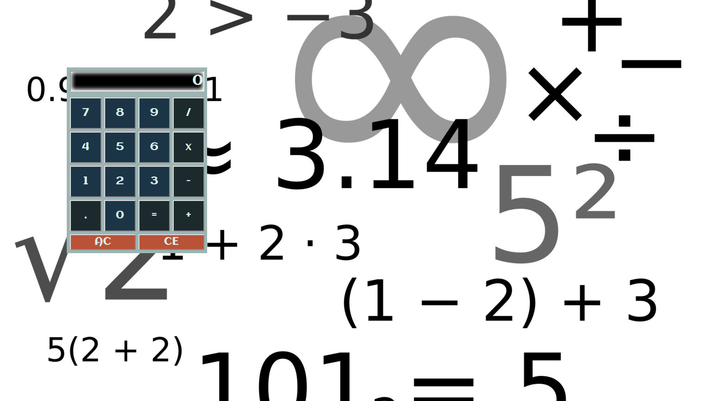

# README
## Calulator
**Calculator** is a simple JavaScript calculator.

### Author / Contact
*  [github](http://www.github.com/argoncode)
*  [twitter](http://twitter.com/argoncode)
* [personal website](http://argoncode.com/contact)

### Used tech and libraries
1. HTML
2. CSS
3. JavaScript
4. jQuery

## Current features:

## Planned features

## Copying / License
1. MIT
2. LINKWARE for favicons: [pelfusion.com](http://www.pelfusion.com).

## Bugs
1. Report via pull request and/or comments.
2. Current bugs are on [github issus](https://github.com/ArgonCode/calculator/issues) and [waffle](https://waffle.io/ArgonCode/calculator).
